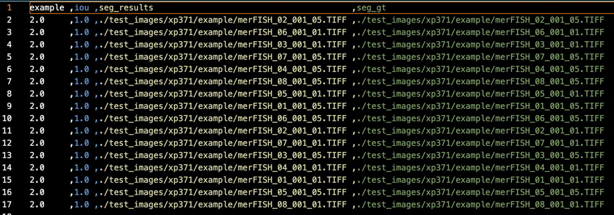
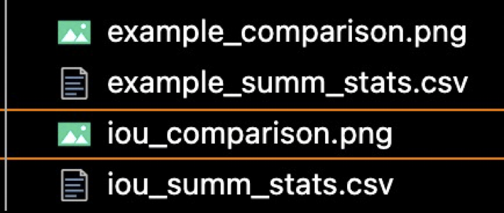
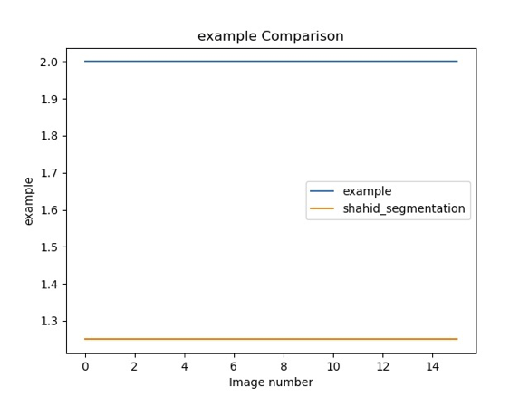
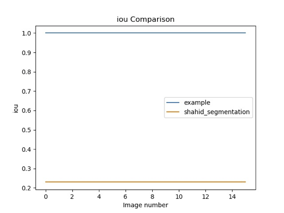
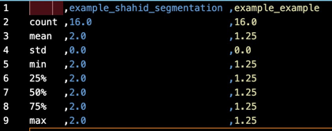
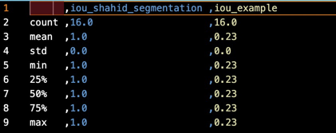

# Cell Segmentation Tool
## Installation

Required Packages:
    * Python(>3.6)
    * click
    * numpy
    * pandas
    * scikit-image
    
## Purpose
The purpose of this application to to:
1. Perform a segmentation task on MERFISH images with any algorithm of their choosing
2. Extract segmentation performance metrics in comparison to a 1:1 ground truth image of the image
3. Compare the segmentation performance metrics and put them in a graph. As well product files that will provide summary statistics to compare segmentation methods with

## Design

### Motivation

Along with satisfying the purpose of the Tool, the design philosophy here was to allow extensibility and flexibility in the methods and metrics used such that future researchers can compare their algorithm to a wealth of new methods and new metrics without having to repeat a lot of boiler plate.


### Realisation

Using the flexibility of python modules and function pointers,:
* Any segmentation method can be added to the tool by dropping a python file with a specific wrapper function with a unique name
* Any segmentation metric can be added to the tool by dropping a python file with a specific wrapper function with a unique name
* Once method/metric has been imported and registered, then they can be easily accessed from the command line

### File Structure

📦cellseg_prog</br>
┣ 📂seg_methods</br>
┃ ┣ 📜__init__.py</br>
┃ ┣ 📜example.py</br>
┣ 📂seg_metrics</br>
┃ ┣ 📜__init__.py</br>
┃ ┣ 📜example.py</br>
┣ 📜cell_seg.py* </br>
*is the entry point

### Adding Segmentation Method

Any new segmentation method needs to have the following signature:

``` def <method_name>(im2seg:numpy.ndarray) ->numpy.ndarray ```

The ```<method_name>``` is the name used in command line to tell it to perform that segmentation method on the image(s) you specify

### Adding Metrics

Any new metric that needs to have the following signature:

```def <metric_name>(im_seg: np.ndarray,im_gt:np.ndarray)->float```

The ```<metric_name>``` is the name used in command line to tell it to perform that segmentation method on the image(s) you specify

### Registering new methods and metrics
There is a ```__init__.py``` in the ```seg_methods``` and ```seg_metrics``` folder.
In those files, you will need to import the new python file in the following way

```from .<python filename> import *```

## Usage
### Main
[](https://asciinema.org/a/TKFx9eikPbUqxA0hs0ZdWEmzg)

### Segment
[](https://asciinema.org/a/zDys6Y330IBxDfTSBcchlorgV)

[](https://asciinema.org/a/dNB5hzBQj61Tmgqlarl56fKYu)

### Calculate Metric

[](https://asciinema.org/a/hwcZ9UB1pQuYZLnSOTfiFF2Xa)

[](https://asciinema.org/a/WDO6rCa2MpF5ty0e1qNHM57Bk)

The output of the ```calculate_metric``` command:


### Compare Metrics

[](https://asciinema.org/a/Ml5K9fylDhHaizQ83qO2CbRqz)

[](https://asciinema.org/a/qBEXcgZeuoTPCKgVva8Bl3Rq8)

The outputs of the ```compare_metrics``` command are
</br>
</br>
</br>
</br>
</br>


## Additional Notes
In actuality, you do not need to create a separate python file for a new method or metric.
The name used in the command line is actually the function name, not the filename

